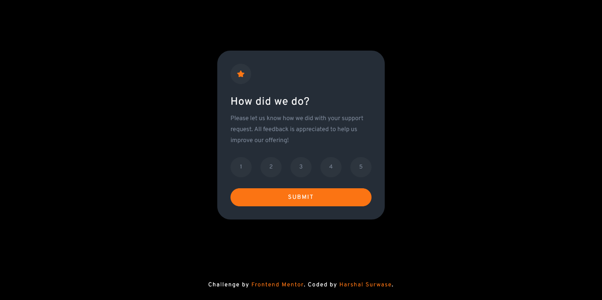

# Frontend Mentor - Interactive rating component solution

This is a solution to the [Interactive rating component challenge on Frontend Mentor](https://www.frontendmentor.io/challenges/interactive-rating-component-koxpeBUmI). Frontend Mentor challenges help you improve your coding skills by building realistic projects.

## Table of contents

- [Overview](#overview)
  - [The challenge](#the-challenge)
  - [Screenshot](#screenshot)
  - [Links](#links)
- [My process](#my-process)
  - [Built with](#built-with)
  - [What I learned](#what-i-learned)
  - [Continued development](#continued-development)
  - [Useful resources](#useful-resources)
- [Author](#author)
- [Acknowledgments](#acknowledgments)

**Note: Delete this note and update the table of contents based on what sections you keep.**

## Overview

### The challenge

Users should be able to:

- View the optimal layout for the app depending on their device's screen size
- See hover states for all interactive elements on the page
- Select and submit a number rating
- See the "Thank you" card state after submitting a rating

### Screenshot

### Links

- Solution URL: [Add solution URL here](https://your-solution-url.com)
- Live Site URL: [Add live site URL here](https://your-live-site-url.com)

## My process

### Built with

- Semantic HTML5 markup
- CSS custom properties
- Flexbox
- Javascript

If you want more help with writing markdown, we'd recommend checking out [The Markdown Guide](https://www.markdownguide.org/) to learn more.

### Continued development

currently, I am learning javascript's frontend library React js. but first understanding how javascript works on the web is very important.

### Useful resources

- [stackoverflow](https://www.stackoverflow.com) - This helped me for changing the image when cliked. I really liked this pattern and will use it going forward.
- [MDN](https://developer.mozilla.org) - this is great platform of every developer to understand how it works.

## Author

- Website - [Harshal Surwase](https://harshalfsd.github.io/personal-portfolio/)
- Frontend Mentor - [@HarshalFSD](https://www.frontendmentor.io/profile/HarshalFSD)
- Twitter - [@harshal_surwase](https://www.twitter.com/harshal_surwase)

## Acknowledgments

first, make it work, then it will be a beautiful work.
